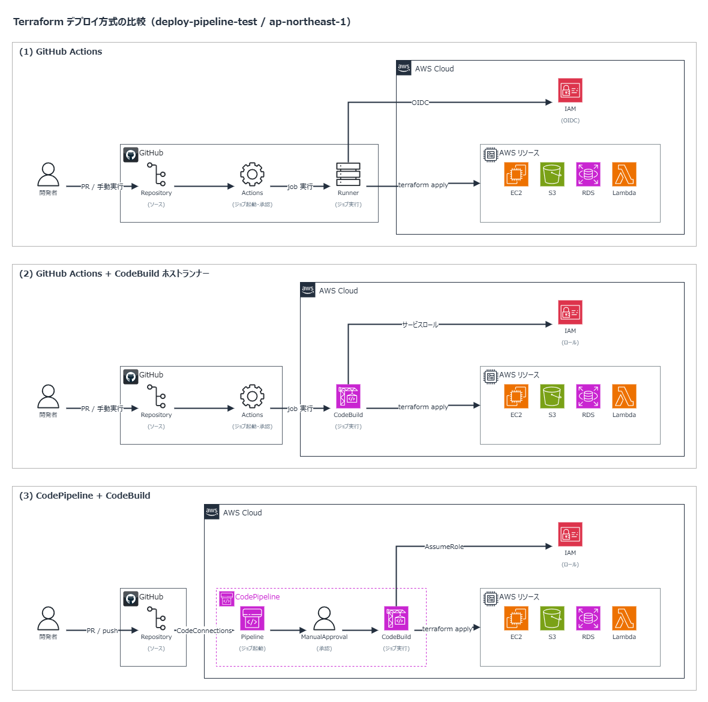

## はじめに

Terraform のデプロイ方式を3つ実装して比べてみました。

Terraform はいろいろな種類のリソースを作成・変更・削除するので、CI/CD には IAM の操作も含めて比較的強い権限を渡しておくことが多いです。そのぶん、どの方式でどこから AWS の権限を得るかによって、GitHub が侵害されたときの影響が大きく変わります。

デプロイ対象は S3 だけにして、パイプライン側の違いだけが見えるようにしています。比べるのは次の3つです。

- (1) GitHub Actions
- (2) GitHub Actions + CodeBuild ホストランナー
- (3) CodePipeline + CodeBuild

それぞれ PR で plan、承認を挟んで apply するところまで組んで、最後に表で並べます。

## 3つの方式の全体像



違いは「どこで起動して、どこで実行して、どうやって AWS に入るか」の3点に集約されます。

(1) は GitHub がソースからデプロイ実行までの責務を全て持ちます。ランナーも GitHub のもので、AWS には OIDC でロールを借りて入ります。

(2) はワークフロー定義を GitHub に置いたまま、実行だけ CodeBuild に渡します。CodeBuild のサービスロールで動くので、OIDC の設定が不要。

(3) は起動も承認も AWS 側です。GitHub はコードの置き場で、CodeConnections でつないだ CodePipeline がソースを取りに行きます。

## やってみる

### (1) GitHub Actions

PR をきっかけに plan する workflow です。AWS へは OIDC でロールを借ります。

```yaml
# .github/workflows/terraform-plan-github-runner.yml（抜粋）
on:
  pull_request:
    branches:
      - main
    paths:
      - "terraform-resource/**"

permissions:
  id-token: write
  contents: read

jobs:
  plan:
    runs-on: ubuntu-latest
    defaults:
      run:
        working-directory: terraform-resource
    steps:
      - uses: actions/checkout@v4
      - uses: aws-actions/configure-aws-credentials@v2
        with:
          role-to-assume: arn:aws:iam::${{ secrets.AWS_ACCOUNT_ID }}:role/${{ secrets.AWS_CICD_ROLE_NAME }}
          aws-region: ap-northeast-1
      - uses: hashicorp/setup-terraform@v2
        with:
          terraform_version: 1.6.6
      - run: terraform plan -no-color -input=false
```

apply 側は `workflow_dispatch` の手動実行にして、`if: ${{ github.ref == 'refs/heads/main' }}` で main 以外からは走らないようにしています。

### (2) GitHub Actions + CodeBuild ホストランナー

(1) の workflow から変えるのは、`runs-on` の1行と、AWS ログインのステップを消すことだけです。

```yaml
jobs:
  plan:
    runs-on: codebuild-deploy-pipeline-test-${{ github.run_id }}-${{ github.run_attempt }}
```

`codebuild-` の後ろが CodeBuild のプロジェクト名で、このラベルのジョブを CodeBuild が拾って実行します。認証は CodeBuild のサービスロールが持つので、`configure-aws-credentials` は要りません。このプロジェクトは Terraform の管理外にしています。

### (3) CodePipeline + CodeBuild

apply 用のパイプラインは、Source・Plan・Approve・Apply の4ステージにします。

```hcl
# modules/codepipeline/tf-apply-pipeline.tf（抜粋）
resource "aws_codepipeline" "terraform_apply" {
  name          = "${var.environment}-${var.project}-terraform-apply"
  pipeline_type = "V2"

  stage {
    name = "Approve"

    action {
      name     = "ManualApproval"
      category = "Approval"
      owner    = "AWS"
      provider = "Manual"
      version  = "1"
    }
  }
  # Source / Plan / Apply の各ステージは省略
}
```

plan 用は別のパイプラインにして、トリガーを PR の `OPEN` と `UPDATED` にしています。ブランチやファイルパスでの絞り込みは V2 パイプラインの `trigger` ブロックに書けます。

CodeBuild には workflow の代わりに buildspec を渡します。やっていることは (1) のステップと同じです。

```yaml
# buildspec_plan.yml（抜粋）
version: 0.2
phases:
  install:
    commands:
      - curl -sL "https://releases.hashicorp.com/terraform/${TF_VERSION}/terraform_${TF_VERSION}_linux_amd64.zip" -o terraform.zip
      - unzip -q terraform.zip -d /usr/local/bin
  pre_build:
    commands:
      - cd ${TF_WORKING_DIR}
      - terraform init -input=false
  build:
    commands:
      - terraform plan -no-color -input=false
```

実行の開始・成功・失敗と承認待ちは、通知ルールで Chatbot 経由で Slack に送ります。Chatbot と Slack の連携は[前の記事](/blog/terraform-eventbridge-root-login-detection/)と同じです。

```hcl
# modules/codepipeline/tf-apply-pipeline.tf（抜粋）
resource "aws_codestarnotifications_notification_rule" "apply_pipeline" {
  resource    = aws_codepipeline.terraform_apply.arn
  detail_type = "FULL"

  event_type_ids = [
    "codepipeline-pipeline-pipeline-execution-failed",
    "codepipeline-pipeline-manual-approval-needed",
  ]

  target {
    type    = "AWSChatbotSlack"
    address = var.chatbot_arn
  }
}
```

## 評価

| 項目                   | (1) GitHub Actions       | (2) GHA + CodeBuild      | (3) CodePipeline             |
| ---------------------- | ------------------------ | ------------------------ | ---------------------------- |
| トリガー・承認         | GitHub                   | GitHub                   | CodePipeline                 |
| ランナー               | GitHub                   | CodeBuild                | CodeBuild                    |
| IAM 認証               | OIDC                     | サービスロール           | サービスロール               |
| ログ保存期間           | △<br>最大 90 日          | △<br>最大 90 日          | 〇<br>無期限                 |
| 設定の手間             | 〇<br>少ない             | 〇<br>少ない             | △<br>多い                    |
| AWS 側のコスト         | 〇<br>なし               | △<br>あり                | △<br>あり                    |
| ランナーのカスタマイズ | △<br>限定的              | 〇<br>柔軟               | 〇<br>柔軟                   |
| VPC 内へのアクセス     | △<br>できない            | 〇<br>できる             | 〇<br>できる                 |
| セキュリティ           | △<br>GitHub 侵害の影響大 | △<br>GitHub 侵害の影響大 | 〇<br>コードとデプロイを分離 |

### GitHub が侵害されたときのリスク

(1) は、workflow を動かせる人が OIDC で AWS のロールを借りられるので、GitHub のアカウントやトークンを奪われるとそのまま AWS に入られます。リソースの破壊や改ざん、データの持ち出し、IAM ユーザーを作って乗っ取られる、といったことが起こりえます。

そのため、信頼ポリシーの `sub` を environment やブランチで絞り、apply は承認ルール付きの environment からしか借りられないロールに分けておく必要があります。`.github/workflows/` の変更もブランチ保護でレビュー必須にしておく必要があります。

それでも承認の仕組みは GitHub の中にあるので、リポジトリや Organization の管理者権限まで奪われると、保護ルールごと外されてしまいます。

(2) も起動と承認は GitHub にあるので、(1) と同じ GitHub 側の対策が必要です。

そのうえ CodeBuild のサービスロールは、OIDC と違ってブランチ単位で借りる条件を付けられません。plan と apply で CodeBuild プロジェクトとロールを分け、ウェブフックのフィルターで受け付けるリポジトリやワークフローを絞っておかないといけません。VPC 内に置く場合は、侵害されたジョブから VPC 内の DB などにも届くので、セキュリティリスクはより高まります。

(3) は起動も承認も AWS 側にあるので、GitHub を押さえられても、AWS で承認を通さない限り apply まで進みません。

buildspec は別リポジトリで管理する必要があります。リポジトリから読ませると実行するコマンドごと書き換えられるからです。承認できる人も IAM の `codepipeline:PutApprovalResult` で絞っておきます。

また、Terraform は `external` データソースなどで任意のプログラムを動かせるので、承認なしでplan を動かす場合は読み取り専用のロールに分けないといけません。

### 運用のしやすさ

(1) と (2) は、plan の結果が PR の Checks に出て、承認も GitHub の environment で済むので、レビューからデプロイまでが PR の中で完結します。

(3) は結果が GitHub に返ってこないので、運用がしづらくなります。plan の差分を読むにも承認するにも AWS コンソールを開くことになり、レビューする人全員に AWS の権限が要ります。コードは PR でレビューしてデプロイの判断は別の画面で行うことになり、PR の履歴とデプロイの履歴も別々の場所に残ります。plan の結果を PR にコメントで返す仕組みは自前で作れますが、そうすると AWS 側に GitHub のトークンを置くことになり、分けたはずの2つがまたつながります。

### まとめ

GitHub が侵害されたときに AWS を守れる度合いと、GitHub の中で完結する運用のしやすさが引き換えになっています。

- (1) は設定が一番軽く運用も GitHub で完結しますが、リポジトリや Organization の管理者権限まで奪われると影響が大きいです。
- (2) は VPC 内に届く実行環境が手に入る一方、GitHub からVPC内にアクセスできてしまうため一番セキュリティに気を付ける必要あり。
- (3) は GitHub の権限が侵害されても apply までは実行されない。しかし、レビューとデプロイが分かれて運用が重くなる

Terraformを使う場合はplanは(1), Applyは(3)のようにハイブリッドにするのがいいかもしれません。
