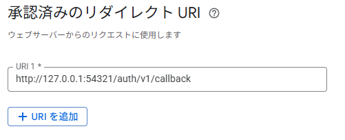
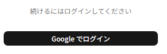
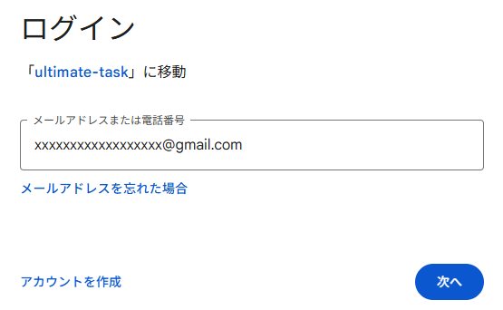
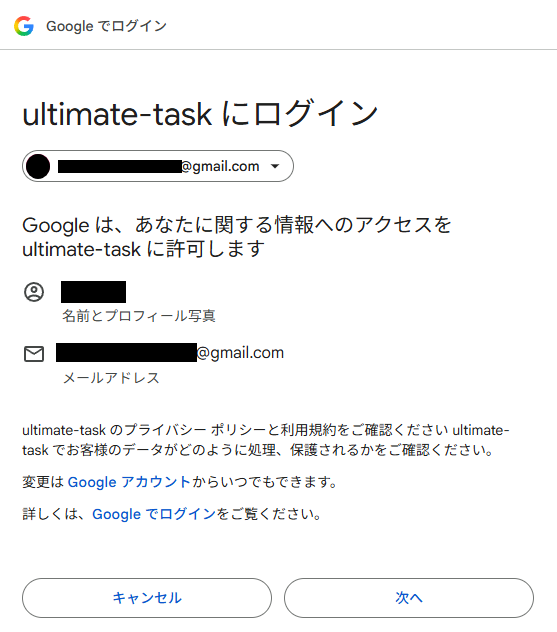
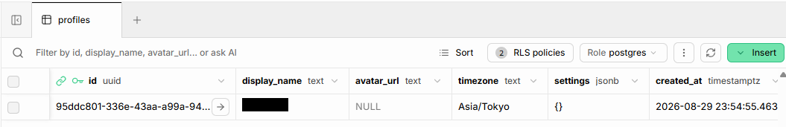

## はじめに

最近フロントエンドの勉強をはじめました。「てる」です。

SupabaseやNext.jsを使って、タスク管理アプリを作っていきます。
最初に、Google認証でログインできる機能を作ります。

Supabase の Google ログインは、**ローカルだけで一通り試せるとのこと**。
Supabase CLI が コンテナで認証サーバーごと立ち上げてくれるので、Google Cloud Console で OAuth クライアントを1つ作れば、あとはローカルで完結するらしい。

この記事では、Supabase のローカル環境で Google OAuth ログインを実装してログイン成功までやってみます。

## Supabase のローカル環境とは

Supabase CLI が Docker コンテナ一式を立ち上げて、クラウド版とほぼ同じものを手元に再現する仕組みです。

`npx supabase start` を叩くと12個のコンテナが立ちます。

```
db / auth / rest / realtime / storage / studio / kong /
inbucket(メール受信箱) / pg_meta / edge_runtime / vector / analytics
```

Supabase は Postgres 単体ではなく、Postgres の周りに認証・API・ストレージを束ねた集合体だとわかります。認証を担当しているのは `auth` コンテナ（GoTrue）で、今回いじる設定はほぼここに効きます。

ローカルでやる利点は2つです。

- **壊してもやり直せる。** `supabase db reset` でマイグレーションを流し直せる
- **設定がファイルに残る。** クラウドの管理画面でポチポチした設定と違い、`supabase/config.toml` がそのまま構成になる

管理画面（Studio）は `http://127.0.0.1:54323`、API は `54321` 番で待ち受けます。認証の窓口もこの `54321` なので、**Google Cloud Console に登録するリダイレクト URI は `http://127.0.0.1:54321/auth/v1/callback`** になります。アプリを動かす 3000 番ではありません。

## @supabase/ssr とは

サーバー側でも Supabase のセッションを扱えるようにする公式ライブラリです。

素の `supabase-js` はブラウザ前提で、セッションを localStorage に置きます。それだとサーバー側からは読めません。`@supabase/ssr` はセッションを **Cookie** に置くので、Server Component からも Middleware からも同じセッションを見られます。

大事なのは、**実行場所ごとにクライアントを作り分ける必要がある**ことです。整理のためではなく、分けないと動きません。

| ファイル        | 実行場所                                         | Cookie の扱い                                  |
| --------------- | ------------------------------------------------ | ---------------------------------------------- |
| `client.ts`     | ブラウザ                                         | ブラウザ任せ（指定不要）                       |
| `server.ts`     | Server Component / Server Action / Route Handler | リクエストヘッダから読む。書き込みは失敗しうる |
| `middleware.ts` | 全リクエストの入口                               | 読み書きどちらもできる                         |

Server Component が Cookie を書けないのは、HTML の生成が始まった時点でレスポンスヘッダが送出済みで、`Set-Cookie` を後から足せないためです。だからトークンの更新は Middleware に寄せます。

## やってみる

### 1. Supabase のローカル環境を立ち上げる

Docker Desktop を起動してから実行します。

```bash
npx supabase init
npx supabase start
```

**こうなればOK。** `supabase status` で接続情報が並びます。

```
API URL         : http://127.0.0.1:54321
PUBLISHABLE_KEY : sb_publishable_xxxxx
SECRET_KEY      : sb_secret_xxxxx
```

`.env.local` に URL と `PUBLISHABLE_KEY` を置きます。

```
NEXT_PUBLIC_SUPABASE_URL=http://127.0.0.1:54321
NEXT_PUBLIC_SUPABASE_PUBLISHABLE_KEY=sb_publishable_xxxxx
```

CLI は devDependency にも入れておきます。`package.json` の scripts から `supabase` を呼ぶとき、`npm run` は `node_modules/.bin` を見るので、入れていないと `supabase: not found` になります。

```bash
npm i -D supabase
```

### 2. Google の OAuth クライアントを作る

Google Cloud Console で OAuth クライアント（種別: ウェブアプリケーション）を作成します。

承認済みのリダイレクト URI に登録するのは、**アプリではなく Supabase の URL** です。



認証はこの順で戻ってきます。

```
アプリ(3000) → Google → Supabase(54321) → アプリ(3000)
```

Google が直接アプリに戻すのではなく、いったん Supabase が受けて、そこでセッションを作ってからアプリに返す形です。ここを 3000 番で登録すると `redirect_uri_mismatch` になります。

公開ステータスは「テスト中」のままにして、自分の Google アカウントをテストユーザーに登録しました。テストユーザー以外は OAuth フローを完了できないので、**実装を1行も書かずにアクセス制限がかかります**。

**こうなればOK。** クライアント ID とシークレットが発行されます。この2つは `config.toml` から環境変数経由で参照するので、`.env.local` に控えておきます。

### 3. config.toml に Google プロバイダを設定する

`supabase/config.toml` に追記します。このファイルはコミットするので、シークレットは直接書かず環境変数を参照させます。

```toml
[auth.external.google]
enabled = true
# クライアント ID は秘密情報ではないが、環境ごとに変わるので直接書かない
client_id = "env(SUPABASE_AUTH_GOOGLE_CLIENT_ID)"
secret = "env(SUPABASE_AUTH_GOOGLE_SECRET)"
# ローカルでの Google ログインには nonce チェックの無効化が必要
skip_nonce_check = true
```

リダイレクト先の許可リストも要ります。コメントに「A list of **exact** URLs」とあるとおり、**パスまで完全一致**です。ドメインだけ書いても通りません。

```toml
site_url = "http://localhost:3000"
additional_redirect_urls = ["http://localhost:3000/auth/callback"]
```

`site_url` の既定値は `http://127.0.0.1:3000` ですが、**`localhost` に書き換えています**。`127.0.0.1` のままだと2つ壊れます。

- **JS が読めなくなる。** Next.js の開発サーバーは `127.0.0.1` からの `/_next/*` を 403 で拒否します。ページは表示されるのにボタンが無反応になります
- **Cookie が分かれる。** ブラウザは `localhost` と `127.0.0.1` を別ドメインとして扱うので、混在させると「片方だけログイン済み」になります

どちらも「アプリを開く URL」と「Supabase に登録する URL」を `localhost` で揃えれば起きません。

`config.toml` を変えたら起動し直します。起動中のコンテナには反映されません。

```bash
npx supabase stop && npx supabase start
docker exec supabase_auth_<プロジェクト名> env | grep GOOGLE
```

**こうなればOK。** `env(...)` が解決された状態でコンテナに渡っています。

```
GOTRUE_EXTERNAL_GOOGLE_ENABLED=true
GOTRUE_EXTERNAL_GOOGLE_CLIENT_ID=<解決済みの値>
GOTRUE_EXTERNAL_GOOGLE_SKIP_NONCE_CHECK=true
```

### 4. Supabase クライアントを3つ作る

ライブラリを入れます。

```bash
npm i @supabase/ssr @supabase/supabase-js
```

ブラウザ用

```ts
// src/lib/supabase/client.ts
import { createBrowserClient } from "@supabase/ssr";

export function createClient() {
  return createBrowserClient(
    process.env.NEXT_PUBLIC_SUPABASE_URL!,
    process.env.NEXT_PUBLIC_SUPABASE_PUBLISHABLE_KEY!,
  );
}
```

サーバー用

```ts
// src/lib/supabase/server.ts
setAll(cookiesToSet) {
  try {
    cookiesToSet.forEach(({ name, value, options }) => {
      cookieStore.set(name, value, options);
    });
  } catch {
    // Server Component からは Cookie を書き込めない。
    // セッションの更新は Middleware が行うため、ここでは無視してよい。
  }
}
```

この辺はAIに作ってもらいました。

### 5. profiles テーブルを自動登録するトリガーを作る

Supabase の認証情報は `auth.users` に入ります。
しかし、 `auth.users` は本人しか読めないので、ユーザー同士の共有機能を持たせることができません。

なので `auth.users` にレコードが登録されたら `profiles` にもコピーするようにします。

```bash
npx supabase migration new create_profiles
```

ポイントは、**行の作成をアプリではなく DB のトリガーに任せた**ことです。
これは賛否ありそうな実装です。

メリットは、単一のトランザクションで実行されることです。ユーザーのログインとプロフィール登録は常にセットで実行されます。
デメリットは、ロジックから見えないこと、DB依存なのでDBの移行のときとかに大変。漏れる可能性もあるという点くらいでしょうか。

```sql
create function public.handle_new_user()
returns trigger
language plpgsql
security definer set search_path = ''
as $$
begin
  insert into public.profiles (id, display_name, avatar_url)
  values (
    new.id,
    new.raw_user_meta_data ->> 'full_name',
    new.raw_user_meta_data ->> 'avatar_url'
  );
  return new;
end;
$$;

create trigger on_auth_user_created
  after insert on auth.users
  for each row execute function public.handle_new_user();
```

```bash
npx supabase db reset
```

上記でマイグレーションが流れてテーブルとトリガーができます。

### 6. ログイン画面とコールバックを作る

ログインボタンは Client Component にします。Google へのリダイレクトはブラウザを動かす操作なので、サーバーからは実行できません。

```tsx
"use client";

const handleClick = async () => {
  const supabase = createClient();
  const { data, error } = await supabase.auth.signInWithOAuth({
    provider: "google",
    options: {
      redirectTo: `${window.location.origin}/auth/callback`,
      skipBrowserRedirect: true,
    },
  });
  if (error || !data.url) {
    console.error("signInWithOAuth failed", error);
    setErrorMessage(error?.message ?? "ログインを開始できませんでした");
    return;
  }
  window.location.assign(data.url);
};
```

`skipBrowserRedirect: true` にして自分でリダイレクトしています。ライブラリ任せだと**失敗しても画面に何も起きず、原因が追えない**からです。自分で返り値を見る形にしておけば、`error` をコンソールと画面の両方に出せます。

戻り先は Route Handler にします。Cookie の書き込みが必要だからです。

```ts
// src/app/auth/callback/route.ts
export async function GET(request: Request) {
  const { searchParams, origin } = new URL(request.url);
  const code = searchParams.get("code");
  const next = searchParams.get("next") ?? "/";

  if (code) {
    const supabase = await createClient();
    const { error } = await supabase.auth.exchangeCodeForSession(code);
    if (!error) {
      return NextResponse.redirect(`${origin}${next}`);
    }
  }
  return NextResponse.redirect(`${origin}/login?error=auth`);
}
```

`?code=...` を受け取ってセッションに交換し、Cookie に保存する。これだけです。

`npm run dev` して `http://localhost:3000/login` を開いてボタンが表示されます。



### 7. ログインしてみる

`npm run dev` して `http://localhost:3000/login` からログインします。



**こうなればOK。**



### 8. profilesテーブルの中身確認

profilesテーブルの中身を確認します。

```
npx supabase start
```

`http://127.0.0.1:54323/` を開き、Table Editorで確認できます。



アプリ側にプロフィール作成のコードを1行も書かずに行ができました。

ただし **`avatar_url` は null です。** Google から返る `raw_user_meta_data` にアイコンの URL が入っていません。

```
iss  sub  name  email  full_name  provider_id  email_verified  phone_verified
```

`avatar_url` も `picture` もないので、トリガーの SQL が正しくても null になります。画面を作るときはイニシャル表示にフォールバックさせることにしました。

## まとめ

- **GoogleのOAuthクライアントを使った認証が実装できた**
- **ログイン->プロフィール登録までができた。UUIDはそのまま使えそう**
