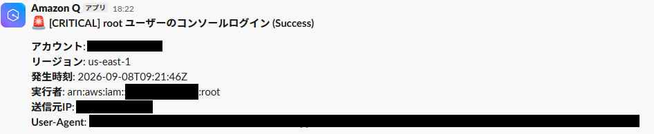

## はじめに

昨今AIによって攻撃が巧妙化している背景があるので、個人のAWSアカウントもセキュリティを強化ししておきたいと思います。
今回はroot ユーザーのログインのような「起きたら即知りたいリスクイベントを検知する仕組みを Terraform で作ってみました。

今回は検知対象のイベントは以下の4つにします。

- root のコンソールログイン
- アクセスキーの作成
- MFA デバイスの無効化・削除
- CloudTrail の停止・改変

EventBridge でイベントを拾って SNS に流し、AWS Chatbot 経由で Slack に出すまでを書きます。

## EventBridge が CloudTrail のイベントを拾う仕組み

CloudTrail は AWS API イベントを記録するサービスで、記録されたイベントは EventBridge の既定バスにも `AWS API Call via CloudTrail` という形で流れてきます。
あとはルールでパターンマッチさせて SNS に飛ばすだけです。

ただし前提として、CloudTrailが有効なリージョンでしかイベントが届かないため、事前にCloudTrailの証跡は有効化しておきます

さらに、IAM や root のコンソールサインインはグローバルサービス扱いなので、イベントは us-east-1 にしか記録されません。
東京リージョンだけ見ていても root のログインは拾えないため注意が必要です。

## やってみる

### 1. us-east-1 の provider と SNS トピックを用意する

Terraformで記述して、GitHubActionsで構築します。

途中でハマったポイントがあったのですが、気が向いたら記事にします。
（GitHubのトークンのsubクレームの形式が変わっておりOIDCでロールを引き渡せなかった）

グローバルサービスのイベント用に alias 付きの provider を足します。

```hcl
provider "aws" {
  alias  = "us_east_1"
  region = "us-east-1"
}
```

EventBridge のターゲットはルールと同じリージョンにしか置けないので、SNS トピックは us-east-1 と ap-northeast-1 に1つずつ作ります。

トピックのアクセスポリシーで `events.amazonaws.com` からの `sns:Publish` を許可しておかないと、ルールは動いているのに通知が出ない状態になるので注意。

```
resource "aws_sns_topic_policy" "alert" {
  arn = aws_sns_topic.alert.arn

  policy = jsonencode({
    Version = "2012-10-17"
    Statement = [
      {
        Sid       = "AllowEventBridgePublish"
        Effect    = "Allow"
        Principal = { Service = "events.amazonaws.com" }
        Action    = "sns:Publish"
        Resource  = aws_sns_topic.alert.arn
        Condition = {
          StringEquals = {
            "aws:SourceAccount" = var.aws_account_id
          }

        }
      }
    ]
  })
}
```

### 2. 検知ルール（EventBridgeルール）を書く

root のコンソールログインは `userIdentity.type` が `Root` かどうかで拾えます。成功も失敗も同じイベントに乗ってきます。

```hcl
resource "aws_cloudwatch_event_rule" "root_console_login" {
  provider = aws.us_east_1

  name = "${var.env}-${var.service_name}-root-console-login"

  event_pattern = jsonencode({
    "detail-type" = ["AWS Console Sign In via CloudTrail"]
    detail = {
      userIdentity = {
        type = ["Root"]
      }
    }
  })
}
```

CloudTrail の停止（`StopLogging` や `DeleteTrail`）だけは alias なしの provider で作ります。証跡のあるリージョンで API が呼ばれるためです。

### 3. Chatbot が受け取れる形にメッセージを組む

AWS Chatbot はカスタム通知形式の JSON しか Slack に転送しません。プレーンテキストを SNS に投げると、エラーも出ずに消えます。`input_transformer` で `version` / `source` / `content` を持つ形に組み立てます。

```hcl
  input_transformer {
    input_paths = {
      account  = "$.account"
      time     = "$.time"
      userArn  = "$.detail.userIdentity.arn"
      result   = "$.detail.responseElements.ConsoleLogin"
    }

    input_template = <<-EOT
      {
        "version": "1.0",
        "source": "custom",
        "content": {
          "textType": "client-markdown",
          "title": ":rotating_light: root のコンソールログイン (<result>)",
          "description": "*アカウント*: <account>\n*発生時刻*: <time>\n*実行者*: <userArn>"
        }
      }
    EOT
  }
```

`input_paths` に無いフィールドをテンプレートから参照すると、そのターゲットへの配信自体が落ちます。イベントに必ず入っているフィールドだけを並べます。

### 4. Chatbot で Slack に繋ぐ

Amazon Q Developer in chat applications (旧称: AWS Chatbot)は以下のように記述します。

slack_team_idは事前にSlackとAWSを連携しておくと発行されるidで、slack_channel_idはSlackのチャンネルのIDです。

```hcl
resource "aws_chatbot_slack_channel_configuration" "alert" {
  configuration_name = "${var.env}-${var.service_name}"
  iam_role_arn       = aws_iam_role.chatbot.arn

  slack_team_id    = var.slack_team_id
  slack_channel_id = var.slack_channel_id

  sns_topic_arns = [
    module.notification.topic_arn,
    module.notification_global.topic_arn,
  ]

  guardrail_policy_arns = ["arn:aws:iam::aws:policy/ReadOnlyAccess"]
}
```

`guardrail_policy_arns` はReadOnlyAccessにしておきます。

slack_team_id, slack_channel_idは一旦はGitHubシークレットに入れて引き回していますが、将来的にAWSのSecretManagerで管理しようと思います。（CloudTrailでアクセス履歴を追跡できる & IAMで細かい権限管理ができるため）

### 5. Slack側でinviteしておく

よく忘れてしまうのですが、Slack側でもinviteしておかないと通知がとびません。

```bash
/invite @Amazon Q
```

### 6. 動作確認

GitHub Actionsからterraform applyし、

rootユーザーでログインしてみます。

通知が飛んできました。



## まとめ

- EventBridge → SNS → AWS Chatbot で、root ログインなどのリスクイベントを検知できる
- 個人のAWSアカウントを安心して使えるように保護する参考にしていただければ幸いです。
